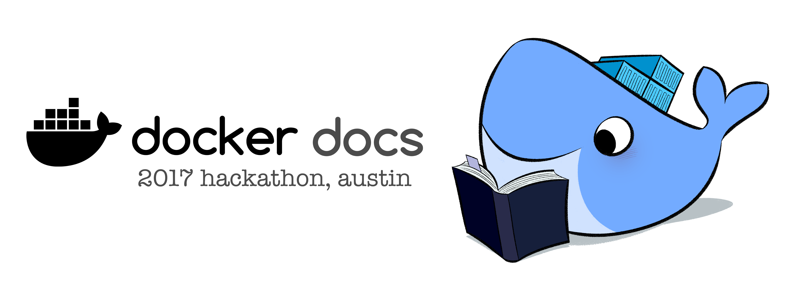



## 文档黑客马拉松，2017年4月17日至22日

修正文档中的错误来换取点数, 通过点数来换取[the swag store](http://www.cafepress.com/dockerdocshackathon)中的奖品. 每10点可以在购物过程中抵用1美元。从DockerCon周活动期间：2017年4月17日至21日。

[黑客马拉松明细](/hackathon/){: class="button outline-btn" style="margin:20px"}[查看Github上值得修复的bug](https://github.com/docker/docker.github.io/milestone/9){: class="button outline-btn" style="margin:20px"} [访问奖励商店](http://www.cafepress.com/dockerdocshackathon){: class="button outline-btn" style="margin:20px"}

## Docker简介

### 学习Docker基础

开始学习Docker的概念、工具和命令。样例中展示了如何构建、推送、拉取Docker镜像，并将它们作为容器运行。
这篇教程详细的介绍了如何发布应用程序。

[开始基础教程](/engine/getstarted/){: class="button outline-btn"}

### 在Swarm模式下定义并发布应用

学习在生产环境中将容器彼此关联，定义服务，配置应用程序栈进行弹性部署。使用Compose Version 3的新特性Highlights以及集群模式。

[学习启动一个Docker应用](/engine/getstarted-voting-app/){: class="button outline-btn"}

## Docker Editions

### Docker Enterprise Edition

Designed for enterprise development and IT teams who build, ship, and run
business critical applications in production at scale. Integrated, certified,
and supported to provide enterprises with the most secure container platform in
the industry to modernize all applications. Docker EE Advanced comes with enterprise
[add-ons](#docker-ee-add-ons) like UCP and DTR.

[Learn more about Docker EE](/engine/installation/#platform-support-matrix){: class="button outline-btn"}

### Docker Community Edition

Get started with Docker and experimenting with container-based apps. Docker CE
is available on many platforms, from desktop to cloud to server. Build and share
containers and automate the development pipeline from a single environment.
Choose the Edge channel to get fast access to the latest features, or the Stable
channel for more predictability.

[Learn more about Docker EE](/engine/installation/#platform-support-matrix){: class="button outline-btn"}

<!-- end row -->

## Run Docker anywhere

    <!--start row-->
    

        

            

                

                    
                

                <h3 id="docker-for-mac"><a href="docker-for-mac/">Mac上的Docker</a></h3>
                
基于macOS沙箱安全模型的原生应用，提供Mac上所有Docker工具。

            

        

        

            

                

                    
                

                <h3 id="docker-for-windows"><a href="docker-for-windows/">Windows上的Docker</a></h3>
                
原生Windows应用程序，提供Windows电脑上所有Docker工具。

            

        

        

            

                

                    
                

                <h3 id="docker-for-linux"><a href="engine/installation/linux/ubuntu/">Linux上的Docker</a></h3>
                
在已经安装Linux发行版的计算机上安装Docker。

            

        

    

    <!--start row-->
    

        

            

                

                    
                

                <h3 id="docker-cloud"><a href="docker-cloud/">Docker Cloud</a></h3>
                
A hosted service for building, testing, and deploying Docker images to your hosts.

            

        

        

            

                

                    
                

                <h3 id="docker-cloud-providers"><a href="/engine/installation/#platform-support-matrix">Docker for AWS</a></h3>
                
Deploy your Docker apps on AWS.

            

        

        

            

                

                    
                

                <h3 id="docker-cloud-providers"><a href="/engine/installation/#platform-support-matrix">Docker for Azure</a></h3>
                
Deploy your Docker apps on Azure.

            

        

    

## Components

<h5>Docker EE Add-ons</h5>

    <!--start row-->
    

    <!--UCP-->
        

            

                

                    
                

                <h3 id="ucp"><a href="datacenter/ucp/2.1/guides/">Docker通用控制面板</a></h3>
                
通过Docker通用控制面板(Docker Universal Control Plane，简称UCP)像管理单个主机那样管理Docker集群。

            

        

    <!--DTR-->
        

            

                

                    
                

                <h3 id="dtr"><a href="datacenter/dtr/2.2/guides/">Docker信任的Registry</a></h3>
                
在防火墙下安装企业镜像存储解决方案(Docker Tusted Registry，简称：DTR)管理镜像及权限。

	    

        

    

    <!-- end real row-->

<h5>Docker Tools</h5>

    <!--start row-->
    

    <!--compose-->
        

            

                

                    
                

                <h3 id="compose"><a href="compose/overview/">Docker Compose</a></h3>
                
Define application stacks built using multiple containers, services, and swarm configurations.

            

        

    <!--machine-->
        

            

                

                    
                

                <h3 id="machine"><a href="machine/overview/">Docker Machine</a></h3>
                
Automate container provisioning on your network or in the cloud. Available for Windows, macOS, or Linux.

        

    

<!-- end component-container 2-->

